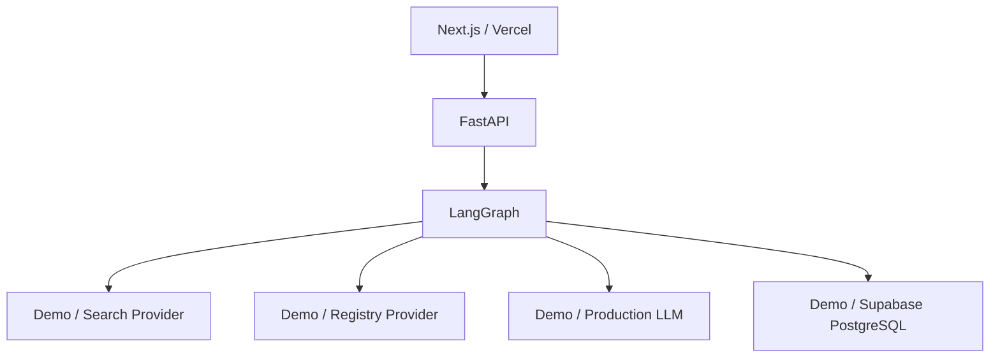

# AgenticFlow — Autonomous B2B Intelligence Programme

> **Client-focused AI agent programme for lead research, verification, qualification, proposal generation, and human-controlled business action.**

## Project Focus

AgenticFlow is an **autonomous B2B intelligence and proposal programme**.

Its purpose is to take a raw business lead and move it through a controlled pipeline:

```text
Lead Input
   ↓
Company Research
   ↓
Domain Verification
   ↓
Registry / Public Verification
   ↓
Data Normalization
   ↓
Lead Quality Scoring
   ↓
Business Recommendation
   ↓
Proposal Generation
   ↓
Human Review
   ↓
Approved Business Action
```

The key client value is not simply "AI generates text". AgenticFlow demonstrates how AI agents can perform **multi-step business research**, use tools, verify evidence, produce structured intelligence, calculate transparent qualification scores, and prepare a personalized proposal while keeping the final decision under human control.

## What This Project Demonstrates

- Autonomous multi-step agents with LangGraph
- Web research and tool augmentation
- Domain and public-information verification
- Structured Pydantic outputs
- Transparent 0–100 lead scoring
- AI-assisted proposal generation
- Human-in-the-loop approval
- Demo providers that require no paid API
- Replaceable AI, search, verification, and storage providers
- Vercel frontend + Python FastAPI backend
- A practical path from portfolio demo to client production

## Demo First, Production Ready by Design

The portfolio version runs with:

```text
Demo AI
Demo Search
Demo Verification
Demo Storage
Synthetic Data
```

All example credentials are **fake DEMO placeholders**. They are not real API keys.

```env
DEMO_MODE=true
NEXT_PUBLIC_DEMO_MODE=true
LLM_PROVIDER=demo
SEARCH_PROVIDER=demo
```

Production can replace those providers with real services without rewriting the core business workflow.

## Documentation

Detailed client documentation is organized into five focused documents:

| Document | Purpose |
|---|---|
| [`docs/client.mdx`](docs/client.mdx) | Business purpose, client journey, programme scope, value, and user experience |
| [`docs/architecture.mdx`](docs/architecture.mdx) | Agent pipeline, system components, data flow, providers, storage, and technical architecture |
| [`docs/deployment.mdx`](docs/deployment.mdx) | Demo deployment, production deployment, environments, hosting, and migration path |
| [`docs/security.mdx`](docs/security.mdx) | Security model, data trust, SSRF protection, secrets, access control, auditability, and production safeguards |
| [`docs/integrations.mdx`](docs/integrations.mdx) | AI, search, registries, CRM, email, storage, authentication, and future integrations |

## Core Programme Pipeline


## Demo Architecture



## Client Production Direction

A typical production client can evolve toward:

```text
Next.js / Vercel
        ↓
FastAPI
        ↓
LangGraph
   ┌────┼─────┐
   ↓    ↓     ↓
Search Verify  AI
   └────┼─────┘
        ↓
PostgreSQL / Supabase
        ↓
Human Review
        ↓
CRM / Approved Business Action
```

Infrastructure should remain simple until actual volume, compliance, reliability, or integration requirements justify additional services.

## Suggested Technology Stack

### Frontend
Next.js, React 19, TypeScript, Tailwind CSS, shadcn/ui, Lucide, Recharts.

### Backend
Python 3.12+, FastAPI, LangGraph, Pydantic v2, Uvicorn, httpx, BeautifulSoup4.

### Storage
DemoStorageProvider for the demo; Supabase PostgreSQL or managed PostgreSQL for production.

### AI
DemoLLMProvider for the demo; Gemini, OpenAI, Anthropic, Azure OpenAI, AWS Bedrock, or another approved provider for production.

### Search
DemoSearchProvider for the demo; Tavily, DuckDuckGo, enterprise search, internal search, or industry-specific providers for production.

## Demo Environment

Example fake values:

```env
DEMO_MODE=true
NEXT_PUBLIC_DEMO_MODE=true
NEXT_PUBLIC_API_URL=http://localhost:8000

LLM_PROVIDER=demo
LLM_MODEL=demo-model

SEARCH_PROVIDER=demo
TAVILY_API_KEY=demo-tavily-key-2026

SUPABASE_URL=https://demo-agenticflow.supabase.co
SUPABASE_SERVICE_ROLE_KEY=demo-service-role-key-2026

NEXT_PUBLIC_SUPABASE_URL=https://demo-agenticflow.supabase.co
NEXT_PUBLIC_SUPABASE_ANON_KEY=demo-supabase-anon-key-2026

PYTHON_SERVICE_API_KEY=demo-python-service-key-2026
CORS_ORIGINS=http://localhost:3000
```

These are placeholders only. When demo mode is enabled, the application must not attempt to use them as real credentials.

## Human-in-the-Loop Principle

AgenticFlow is autonomous in its research workflow but controlled at the business-action boundary.

```text
AI researches
     ↓
AI verifies
     ↓
AI scores
     ↓
AI drafts
     ↓
HUMAN REVIEWS
     ↓
HUMAN APPROVES
     ↓
Business action
```

The system must not automatically send external proposals, emails, contracts, or sales messages without explicit approval.

## Important Trust Principle

The system must distinguish:

```text
Demo Data
Synthetic Data
Public Data
Verified Data
Unverified Data
Unknown
```

A search result is not automatically an authoritative verification. Legal or registry claims require a trustworthy source.

## Documentation Map

Start with [`docs/client.mdx`](docs/client.mdx) for the business story, then read the architecture, deployment, security, and integrations documents for implementation detail.

The intended final experience is:

> **Lead in → autonomous research → verified intelligence → qualified opportunity → human-reviewed proposal → approved business action.**
