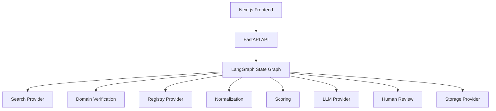
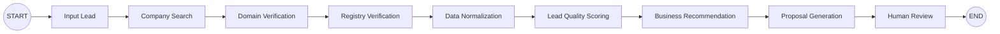
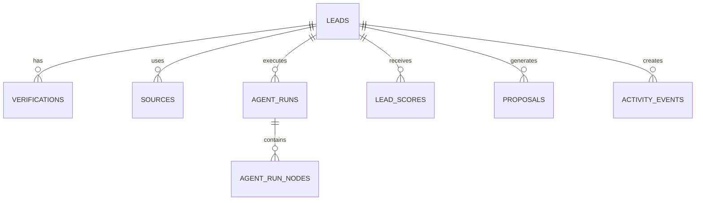
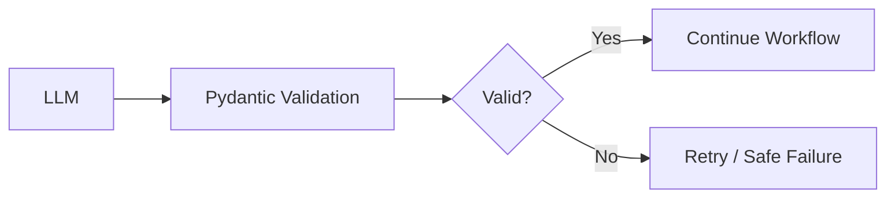
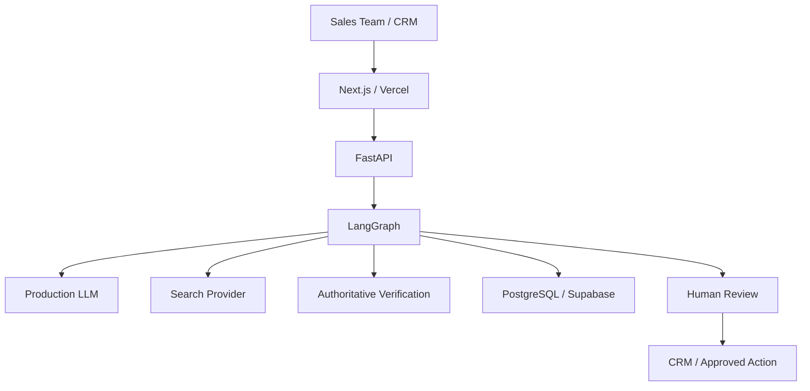

# AgenticFlow — Architecture

## Architecture Objective

The architecture keeps the **business workflow stable** while making infrastructure providers replaceable.



## Core Agent State

The LangGraph state should contain structured information such as:

```text
Lead
Research
Sources
Domain Verification
Registry Verification
Normalized Data
Score
Recommendation
Proposal
Run Metadata
Human Review Status
```

Use typed Pydantic models for important boundaries.

## LangGraph Pipeline



## Provider Abstraction

### Storage

```text
StorageProvider
├── DemoStorageProvider
└── SupabaseStorageProvider
```

### AI

```text
LLMProvider
├── DemoLLMProvider
└── Gemini / OpenAI / Anthropic / Other
```

### Search

```text
SearchProvider
├── DemoSearchProvider
├── DuckDuckGoSearchProvider
└── TavilySearchProvider
```

### Registry

```text
RegistryProvider
├── DemoRegistryProvider
└── ExternalRegistryProvider
```

## Data Model

Recommended tables:

```text
leads
verifications
sources
agent_runs
agent_run_nodes
lead_scores
proposals
activity_events
```



## Search and Verification

Search is for discovery.

Verification is for establishing a higher-trust result.

```text
Search
  ↓
Candidate evidence
  ↓
Source evaluation
  ↓
Official/authoritative source
  ↓
Verification status
```

Never treat a generic search result as proof of legal registration.

## Structured Outputs



## Operational Trace

The UI may show:

```text
Lead received
Search completed
Domain checked
Registry checked
Data normalized
Score calculated
Proposal generated
Human review pending
```

Do not expose hidden chain-of-thought.

## Recommended API Surface

```text
GET    /health
POST   /api/v1/leads
GET    /api/v1/leads
GET    /api/v1/leads/{lead_id}

POST   /api/v1/leads/{lead_id}/run
GET    /api/v1/agent-runs/{run_id}

POST   /api/v1/leads/{lead_id}/verify
POST   /api/v1/leads/{lead_id}/score

POST   /api/v1/leads/{lead_id}/proposal
GET    /api/v1/leads/{lead_id}/proposal
PUT    /api/v1/leads/{lead_id}/proposal

GET    /api/v1/activity
```

## Production Architecture



Start simple. Add queues, workers, Redis, enterprise identity, or other infrastructure only when actual client requirements justify them.
