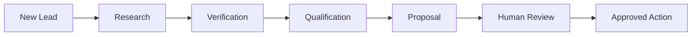

# AgenticFlow — Client Programme Overview

## Executive Summary

AgenticFlow is a B2B AI-agent programme designed to reduce repetitive sales research and proposal preparation.

A salesperson starts with a lead. AgenticFlow researches the company, checks available evidence, normalizes the information, scores the opportunity, recommends the next action, and prepares a personalized proposal.

The human remains responsible for the final business decision.

## Client Problem

A traditional process often looks like:

```text
Lead arrives
   ↓
Salesperson researches company
   ↓
Checks website
   ↓
Searches public information
   ↓
Checks company/registry information
   ↓
Copies information into CRM
   ↓
Decides whether lead is valuable
   ↓
Writes proposal manually
```

This process is repetitive and can vary from salesperson to salesperson.

AgenticFlow standardizes the intelligence workflow.

## Proposed Client Journey



## Business Value

AgenticFlow is designed to help a sales organization:

- reduce repetitive research
- standardize lead qualification
- make evidence easier to review
- create consistent proposal structure
- improve personalization
- maintain human control
- create an auditable workflow

The programme should be evaluated using client-specific KPIs rather than generic AI claims.

Possible KPIs include:

```text
Research time per lead
Qualification time
Proposal preparation time
Verified-data coverage
Human review time
Qualified-lead rate
Proposal acceptance rate
```

## User Experience

The application should feel like a professional B2B operations console.

Primary areas:

- Overview
- Lead Pipeline
- New Lead
- Agent Runs
- Verification
- Lead Scoring
- Proposals
- Activity
- Settings

## Example Client Scenario

A salesperson enters:

```text
Company: Northstar Analytics
Industry: Data Analytics
Need: Modernize fragmented data pipelines
```

The system performs:

```text
1. Lead received
2. Company researched
3. Domain checked
4. Public sources collected
5. Verification performed where possible
6. Information normalized
7. Score calculated
8. Recommendation generated
9. Proposal drafted
10. Human reviews
11. Human approves/edits/rejects
12. Approved result can be exported or integrated
```

## Qualification Model

The reference scoring model is:

| Category | Weight |
|---|---:|
| Company Fit | 25 |
| Market Fit | 20 |
| Business Need | 20 |
| Credibility | 20 |
| Engagement Potential | 15 |
| **Total** | **100** |

Classification:

```text
80–100  HOT
60–79   WARM
40–59   COLD
0–39    UNQUALIFIED
```

The client can change these weights to match its own sales strategy.

## Human Control

The programme is not designed to replace the salesperson.

```text
AI does repetitive intelligence work
              ↓
Human makes the business decision
```

The proposal workflow stops at Human Review. External communication should require explicit approval.

## Demo vs Client Production

The demo uses synthetic data and fake credentials.

Production can use:

```text
Real AI
Real Search
Authoritative Verification
Real Database
CRM
Authentication
Monitoring
```

The provider abstractions allow these components to be introduced incrementally.

## Client Success Definition

A successful deployment should demonstrate:

1. Faster lead research.
2. More consistent qualification.
3. Better evidence visibility.
4. Faster proposal preparation.
5. Clear human approval.
6. Reliable auditability.
7. Controlled integration with existing client systems.
