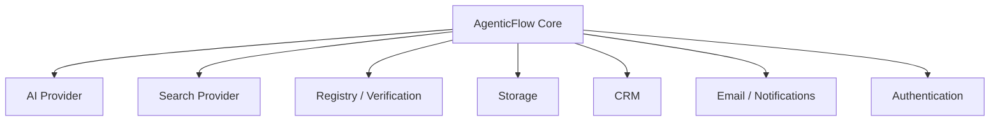
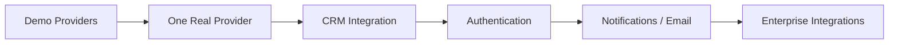

# AgenticFlow — Integrations

## Integration Strategy

Integrations are provider-specific. The core AgenticFlow workflow should not depend directly on one vendor.



## AI Integrations

### Demo

```text
DemoLLMProvider
```

### Production Options

```text
Gemini
OpenAI
Anthropic
Azure OpenAI
AWS Bedrock
```

Selection should depend on:

- quality
- cost
- latency
- privacy
- compliance
- context length
- structured output support

All AI keys remain server-side.

## Search Integrations

### Demo

```text
DemoSearchProvider
```

### Production

```text
Tavily
DuckDuckGo
Enterprise Search
Internal Search
Industry-specific data provider
```

Recommended fallback concept:

```text
Primary Search
   ↓ unavailable
Secondary Search
   ↓ unavailable
Demo / controlled fallback
```

The exact provider should be selected for the client's requirements.

## Registry Integrations

Registry verification should use authoritative sources.

Examples include:

```text
Government company registry
Official business registry
Regulated-industry registry
Trusted registry API
```

The provider should return a structured verification result and source metadata.

## Database Integrations

### Demo

```text
DemoStorageProvider
```

### Production

```text
Supabase PostgreSQL
Managed PostgreSQL
Enterprise PostgreSQL
```

Suggested data:

```text
leads
verifications
sources
agent_runs
agent_run_nodes
lead_scores
proposals
activity_events
```

## CRM Integrations

Potential client integrations:

```text
Salesforce
HubSpot
Other CRM
Internal CRM API
```

Typical workflow:

```text
AgenticFlow
    ↓
Approved Lead Intelligence
    ↓
CRM Record
```

CRM writes should be controlled and auditable.

## Email and Communication

Potential future integrations:

```text
Email provider
Internal notification system
Sales engagement platform
```

The recommended workflow is:

```text
Proposal Generated
       ↓
Human Review
       ↓
Approval
       ↓
Send / Export
```

Do not allow an autonomous agent to send external communication by default.

## Authentication

Production options can include:

```text
OAuth
SSO
Enterprise Identity Provider
Role-based access
```

The client should decide the identity system according to existing IT standards.

## Storage of Documents and Exports

If proposals or research packages become downloadable artifacts, use appropriate object storage and access controls.

Possible options:

```text
Supabase Storage
AWS S3
Google Cloud Storage
Azure Blob Storage
```

## Integration Roadmap



Integrate incrementally. Every integration should have:

- clear ownership
- failure handling
- authentication
- logging
- authorization
- rate limits where applicable
- retry strategy
- auditability

## Client Integration Questions

Before production integration, define:

1. Which CRM is the source of truth?
2. Which AI provider is approved?
3. Which search provider is approved?
4. Which registry sources are authoritative?
5. What information may leave the client's environment?
6. Which users can approve proposals?
7. Which actions require audit records?
8. What retention policy applies?
9. Which integrations are read-only versus write-enabled?
10. What is the acceptable failure/retry behavior?
