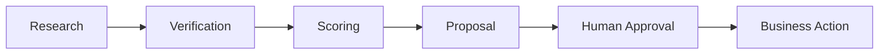

# AgenticFlow — Security

## Security Objective

AgenticFlow should be autonomous in research but controlled at the point where business consequences occur.



## Demo Data Boundary

The demo environment uses synthetic information.

Do not use:

- real customer records
- confidential business information
- private contracts
- sensitive financial information
- credentials
- unnecessary personal data

All demo credentials are placeholders.

## Secrets

Private keys must remain server-side.

Never expose production values through:

```text
NEXT_PUBLIC_*
```

Use platform environment variables and, for larger deployments, a dedicated secret manager.

## SSRF Protection

Because the agent may inspect URLs, server-side requests must be protected against SSRF.

Controls should include:

- URL parsing
- allowed schemes
- hostname validation
- private-network blocking
- redirect validation
- request timeouts
- response-size limits
- safe HTTP clients

## Input Validation

Validate:

- company fields
- email formats
- URLs
- request size
- structured AI output
- provider responses

Use Pydantic for backend data contracts.

## Authentication and Authorization

A real client deployment should introduce:

```text
Authentication
   ↓
User Identity
   ↓
Role / Permission
   ↓
Authorized Action
```

Possible roles:

```text
Admin
Sales Manager
Sales Representative
Reviewer
Read Only
```

## Human Approval

External actions should require explicit approval.

```text
AI Proposal
   ↓
Human Review
   ├── Approve
   ├── Edit
   ├── Reject
   └── Export
```

No automatic outreach should occur without authorization.

## Trust Model

```text
Authoritative Registry
        ↓
High Trust

Official Company Source
        ↓
High/Medium Trust

Trusted Secondary Source
        ↓
Medium Trust

General Search Result
        ↓
Discovery Evidence

Unverified Claim
        ↓
Do Not Present as Confirmed
```

## Verification Rules

The application must never fabricate:

- legal registration
- financial information
- certifications
- customer relationships
- employee counts
- partnerships
- business results

If a source cannot establish a claim, mark it:

```text
UNKNOWN
```

or otherwise clearly unverified.

## Auditability

Record important events such as:

```text
Who created the lead
When research ran
Which sources were used
Which verification was performed
What score was produced
Who reviewed the proposal
What action was approved
```

Do not store hidden chain-of-thought.

Store safe operational metadata instead.

## Production Controls

Recommended controls:

- HTTPS
- authentication
- authorization
- secure CORS
- rate limiting
- request size limits
- SSRF protection
- secret management
- database RLS where appropriate
- audit logs
- structured errors
- monitoring
- backups and retention policies
- provider failure handling

Security requirements should ultimately be aligned with the client's industry and compliance obligations.
